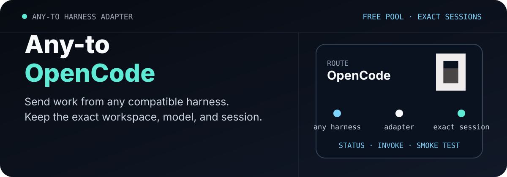

<p align="center">
  
</p>

<p align="center">
  <a href="./LICENSE"></a>
  
  
  
  
</p>

> **让 Codex 当调度员，把 OpenCode 的限免模型组织成一组先试后用的外部协作者。**
>
> 通俗一点：先把免费模型逐个跑一遍，再把真正能用的算力分配给任务——羊毛可以薅，结果必须验。

`codex-opencode-session` 是一个面向 Codex 的个人 Skill。它可以刷新 OpenCode 模型目录、识别公开价格为零的活动模型、并发执行真实 smoke test，再通过隔离的本地 OpenCode 会话完成分析、审查或编码任务。

## 先看实测

2026-08-27 使用 Windows、Python 3.14 与 OpenCode 1.18.23 实测。免费模型状态会随地区、限时活动、账户额度和服务负载变化，下面记录的是一次真实快照。

| 路线 | 模型 | 本次结果 | 依据 |
| --- | --- | --- | --- |
| OpenCode Go | `muse-spark-1.2-contributor` | ✅ 通过 | 精确返回 `OPENCODE_SESSION_OK`，当前默认模型 |
| OpenCode Zen | `nemotron-3-ultra-free` | ✅ 通过 | 首次 smoke test 通过 |
| OpenCode Zen | `nemotron-3.5-lightning-free` | ✅ 通过 | 第二次 smoke test 通过 |
| OpenCode Zen | `big-pickle` | ⚠️ 当前额度受限 | 两次会话超时；官方端点返回 `FreeUsageLimitError` |
| OpenCode Zen | `hy3-free` | ⚠️ 当前额度受限 | 两次会话超时；官方端点返回 `FreeUsageLimitError` |
| OpenCode Zen | `mimo-v2.5-free` | ⚠️ 当前额度受限 | 两次会话超时；官方端点返回 `FreeUsageLimitError` |
| OpenCode Zen | `muse-spark-1.2-contributor-free` | ⚠️ 当前额度受限 | 两次会话超时；官方端点返回 `FreeUsageLimitError` |

Go 是每月 10 美元的订阅服务；当前默认的 Muse Contributor 属于 Go 模型阵容，不能称为零费用模型。Zen 才提供公开标价为零的限时免费模型。模型与价格请以 [OpenCode Zen 官方说明](https://opencode.ai/docs/zen/) 和 [OpenCode Go 官方说明](https://opencode.ai/docs/go/) 为准。

## 最快开始

### 1. 让 Codex 自动检查免费模型池

在 Codex 中直接说：

```text
Use $codex-opencode-session to refresh the OpenCode free model pool,
smoke-test it with 3 concurrent workers, and dispatch only the models
that return a verified reply and delete their test sessions successfully.
```

对应命令：

```powershell
python "$env:USERPROFILE\.codex\skills\codex-opencode-session\scripts\opencode_session.py" `
  free-pool `
  --dir "D:\safe\test-dir" `
  --provider opencode `
  --parallel 3 `
  --timeout 300 `
  --json
```

`free-pool` 不依赖模型名称中的 `free` 字样。它读取实时元数据，只选择 active 且输入、输出、缓存读写价格全部为零的模型，然后并发验证回复、实际模型和会话清理。

### 2. 把任务交给已经通过的模型

```powershell
python "$env:USERPROFILE\.codex\skills\codex-opencode-session\scripts\opencode_session.py" `
  invoke `
  --dir "D:\path\to\repo" `
  --model "opencode/nemotron-3-ultra-free" `
  --agent plan `
  --title "review-api" `
  --prompt "检查这个项目的 API 实现，并给出可验证的修改建议。" `
  --json
```

真实任务可以启动多个独立 `invoke` 进程。每个进程都应有明确的目录、模型、标题和提示词；Codex 最后检查文件差异和测试结果。免费服务常有并发与额度限制，建议从 2–3 路开始。

### 3. 继续准确会话

```powershell
python "$env:USERPROFILE\.codex\skills\codex-opencode-session\scripts\opencode_session.py" `
  invoke `
  --dir "D:\path\to\repo" `
  --session-id "ses_xxxxx" `
  --prompt "根据刚才的检查结果继续处理。" `
  --json
```

继续任务时使用创建该会话时的工作目录，并明确传入准确 `session_id`。

## 四个稳定命令

| 命令 | 用途 | 会话处理 |
| --- | --- | --- |
| `status` | 检查 CLI、版本、数据库与默认模型 | 不创建会话 |
| `free-pool` | 发现零成本模型并并发试跑 | 测试会话自动删除 |
| `invoke` | 创建或继续真实 OpenCode 会话 | 正式会话保留 |
| `smoke-test` | 验证指定模型与本地 API | 测试会话自动删除 |

脚本为每次调用选择空闲端口，服务仅监听 `127.0.0.1`，认证密码随机生成。它只关闭自己启动的进程树，不会统一终止桌面端、TUI 或其他 OpenCode 服务。

## 调度过程

```text
Codex
  └─ free-pool
       ├─ 刷新 OpenCode 实时模型元数据
       ├─ 筛选 active + 全部公开成本为 0
       ├─ 以指定并发量创建隔离 smoke test
       ├─ 核对 reply / actual_model / session cleanup
       └─ 返回通过项与明确失败原因

Codex
  └─ invoke --model <passed-model>
       ├─ 选择空闲端口并生成随机密码
       ├─ 启动 127.0.0.1 上的临时 OpenCode 服务
       ├─ 创建或继续准确会话
       ├─ 等待模型回复并返回结构化结果
       └─ 关闭本次服务；正式会话继续保留
```

## 默认模型

默认配置保存在 [`references/defaults.json`](./references/defaults.json)：

```json
{
  "model": "opencode-go/muse-spark-1.2-contributor"
}
```

用户在任务中指定的模型优先于默认值。单次调用使用 `--model provider/model`，模型支持变体时可额外使用 `--variant high` 等实时元数据中存在的取值。

OpenCode Go 使用 `opencode-go/...`，OpenCode Zen 使用 `opencode/...`。两条线路的模型 ID、订阅方式与凭据相互独立。

## 安装

需要本机已经安装并登录 [OpenCode](https://opencode.ai/)，同时具备 Python 3.10 或更新版本。

```powershell
git clone https://github.com/ZiChenWang114514/codex-opencode-skill.git `
  "$env:USERPROFILE\.codex\skills\codex-opencode-session"
```

重新打开 Codex 任务后即可调用 `$codex-opencode-session`。

## 使用须知

- Zen 免费模型属于限时服务，目录、价格与可用性可能随时变化；每次批量任务前重新运行 `free-pool`。
- `429`、超时、空回复或模型不一致都表示当次未通过。不要通过多账户规避 provider 的额度限制。
- 官方说明指出，部分免费模型会收集提示词和回复用于模型改进；Muse Contributor Free 还涉及未来 Meta 模型训练。敏感、个人或保密内容不应发送到这些免费端点。
- 两款 Nemotron 免费端点属于 NVIDIA 试用服务，相关请求可能被记录用于安全和产品改进。详情见 [Zen Privacy](https://opencode.ai/docs/zen/#privacy)。
- 无人值守 `build` 会允许工具自动执行，只应在用户已经授权的目录与任务中使用；只读检查使用 `--agent plan`。
- API Key 由 OpenCode 自己的登录流程保存，不应出现在命令行参数、日志、README 或 Git 提交中。

## 仓库结构

```text
.
├─ SKILL.md
├─ agents/
│  └─ openai.yaml
├─ references/
│  ├─ defaults.json
│  └─ operation-protocol.md
├─ scripts/
│  └─ opencode_session.py
├─ tests/
│  └─ test_opencode_session.py
└─ assets/readme/
   └─ hero.svg
```

## 验证

```powershell
python -m py_compile .\scripts\opencode_session.py
python -m unittest discover -s .\tests -v
python .\scripts\opencode_session.py status --json
```

Skill 的 YAML、目录名称和模板残留可用 Codex 内置的 `quick_validate.py` 检查。

## License

[MIT](./LICENSE)
